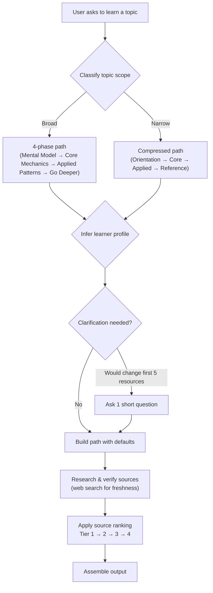
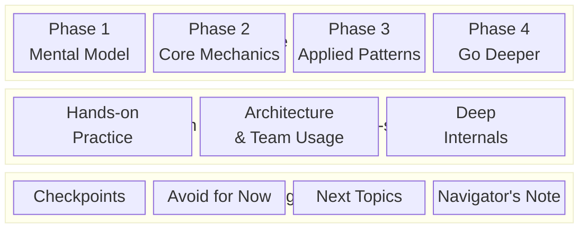
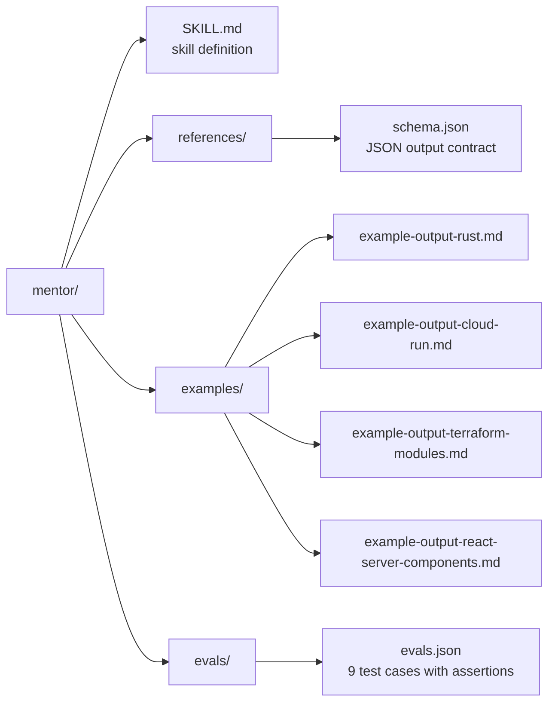

# Mentor

[](LICENSE)

A Claude skill that generates structured, official-first learning paths for technical topics.

## What It Does

Given a topic like "Terraform", "Google Cloud Run", or "React hooks", Mentor generates:

- A learner profile (inferred or defaulted)
- A dependency-ordered core learning path
- Optional exploration branches
- Self-assessment checkpoints
- An explicit skip-list (avoid for now)
- Follow-on topic suggestions

## How It Works



**Source ranking**: official docs first, vendor/maintainer material second, official sample repos third, community content only when it fills a real gap.

## Output Structure



Every core resource includes: source tier, engagement mode (`Read now` / `Skim` / `Hands-on` / `Bookmark as reference`), exact URL, sequencing rationale, and effort estimate.

## Repository Structure



- **SKILL.md** is the source of truth. All behavior rules, output format, source ranking, and anti-patterns live here.
- **references/schema.json** defines the machine-readable output contract for JSON mode.
- **examples/** contains gold-standard outputs demonstrating broad topics, narrow topics, clarification triggers, and user-background adaptation.
- **evals/evals.json** contains 9 test cases with machine-gradable assertions covering structure, source quality, dedup, mode variety, and more.

## Design Principle

Build the shortest credible path to competence from trustworthy sources, while preserving room for exploration.

## Target Runtime

This skill is designed for **Claude.ai** and **Claude Code**. It uses the Claude skill format (`SKILL.md` with YAML frontmatter) and relies on Claude's web search capability to verify resource URLs and freshness.

## Installation

### Option 1: Download the `.skill` file (recommended)

Download [`mentor.skill`](https://github.com/ayhammouda/mentor/releases/latest) from the latest release, then:

| Platform | Command / Action |
|---|---|
| **Claude Code** | `claude skill add mentor.skill` |
| **Claude.ai** | Open a Project → Settings → Skills → Upload `mentor.skill` |

### Option 2: Clone the repository

```bash
git clone https://github.com/ayhammouda/mentor.git ~/.claude/skills/mentor
```

### Option 3: Manual copy

Copy the `mentor/` directory into your Claude skills location (e.g., `~/.claude/skills/mentor/`).

For more details on installing and managing skills, see the official documentation:
- [Claude Code Skills](https://docs.anthropic.com/en/docs/claude-code/skills)
- [Claude.ai Agent Skills](https://docs.anthropic.com/en/docs/agents-and-tools/agent-skills/overview)

## Usage

Ask Claude to learn something:

- *"I want to learn Kubernetes"*
- *"learning path for Terraform modules"*
- *"teach me Rust, I'm a Go developer"*

Mentor activates automatically and generates a structured learning path.

For JSON output, ask explicitly: *"Give me a learning path for Docker in JSON format"*

## Contributing

Contributions welcome! See [CONTRIBUTING.md](CONTRIBUTING.md) for guidelines on proposing changes, adding examples, and strengthening eval coverage.

## License

[MIT](LICENSE)
