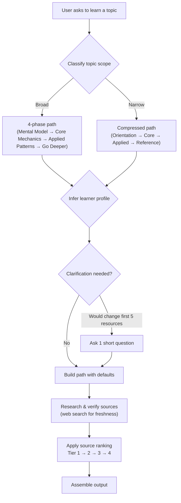
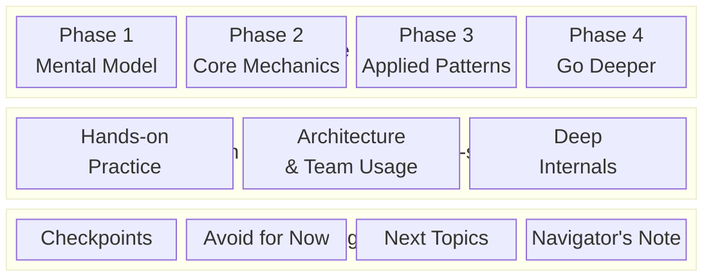
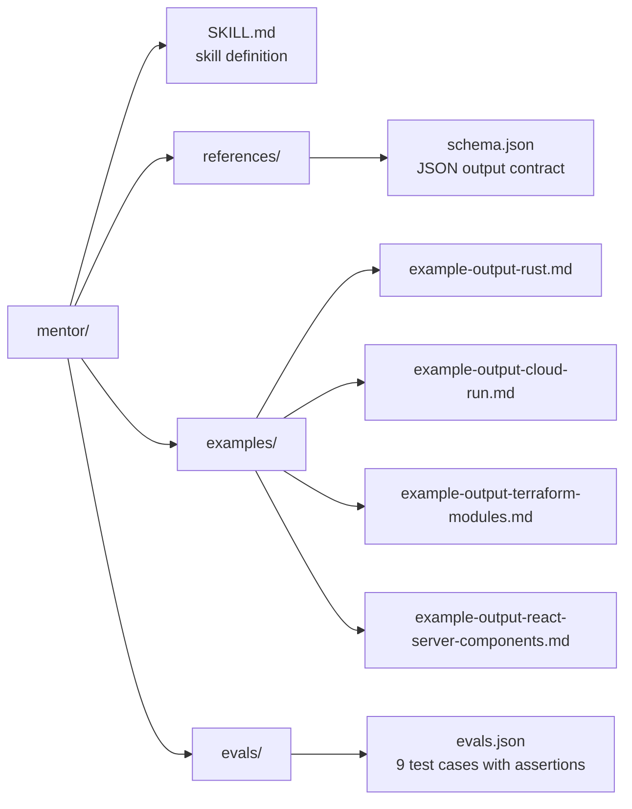

# Mentor

[](https://github.com/ayhammouda/mentor/releases/latest)
[](LICENSE)
[](https://docs.anthropic.com/en/docs/claude-code/skills)
[](https://docs.anthropic.com/en/docs/agents-and-tools/agent-skills/overview)
[](SKILL.md)

A Claude skill for generating structured, official-first, dependency-ordered learning paths for technical topics.

## Why this is different

Most learning-roadmap content online is one of three things:

- generic link dumps
- community-heavy resource lists with weak sequencing
- broad study plans that ignore the learner's actual goal

Mentor is designed to be tighter than that:

- **official-first** when canonical docs exist
- **dependency-ordered** so the path builds in the right sequence
- **practical** about what to read now, skim, practice, or bookmark
- **adaptive** to topic scope, learner background, and time budget
- **skill-native** for Claude, instead of being a blog post pretending to be a tool

## Proof at a glance

- **4 example outputs** covering broad and narrow technical topics
- **9 eval cases** with machine-checkable assertions
- **release-ready `mentor.skill` asset** for direct installation

## What It Does

Given a topic like "Terraform", "Google Cloud Run", or "React hooks", Mentor generates:

- A learner profile (inferred or defaulted)
- A dependency-ordered core learning path
- Optional exploration branches
- Self-assessment checkpoints
- An explicit skip-list (avoid for now)
- Follow-on topic suggestions

## How It Works


```mermaid
flowchart TD
    A["User asks to learn a topic"] --> B{"Classify topic scope"}
    B -->|Broad| C["4-phase path\n(Mental Model → Core Mechanics → Applied Patterns → Go Deeper)"]
    B -->|Narrow| D["Compressed path\n(Orientation → Core → Applied → Reference)"]
    C --> E{"Infer learner profile"}
    D --> E
    E --> F{"Clarification needed?"}
    F -->|"Would change first 5 resources"| G["Ask 1 short question"]
    F -->|No| H["Build path with defaults"]
    G --> H
    H --> I["Research & verify sources\n(web search for freshness)"]
    I --> J["Apply source ranking\nTier 1 → 2 → 3 → 4"]
    J --> K["Assemble output"]
```

**Source ranking**: official docs first, vendor/maintainer material second, official sample repos third, community content only when it fills a real gap.

## Output Structure


```mermaid
block-beta
    columns 1
    block:core["Core Path"]
        columns 4
        p1["Phase 1\nMental Model"]
        p2["Phase 2\nCore Mechanics"]
        p3["Phase 3\nApplied Patterns"]
        p4["Phase 4\nGo Deeper"]
    end
    block:branches["Exploration Branches (optional, non-sequential)"]
        columns 3
        b1["Hands-on\nPractice"]
        b2["Architecture\n& Team Usage"]
        b3["Deep\nInternals"]
    end
    block:supporting["Supporting Sections"]
        columns 4
        s1["Checkpoints"]
        s2["Avoid for Now"]
        s3["Next Topics"]
        s4["Navigator's Note"]
    end
```

Every core resource includes: source tier, engagement mode (`Read now` / `Skim` / `Hands-on` / `Bookmark as reference`), exact URL, sequencing rationale, and effort estimate.

## Repository Structure


```mermaid
flowchart LR
    root["mentor/"] --> skill["SKILL.md\nskill definition"]
    root --> refs["references/"]
    root --> examples["examples/"]
    root --> evals["evals/"]
    refs --> schema["schema.json\nJSON output contract"]
    examples --> ex1["example-output-rust.md"]
    examples --> ex2["example-output-cloud-run.md"]
    examples --> ex3["example-output-terraform-modules.md"]
    examples --> ex4["example-output-react-server-components.md"]
    evals --> evj["evals.json\n9 test cases with assertions"]
```

- **SKILL.md** is the source of truth. All behavior rules, output format, source ranking, and anti-patterns live here.
- **references/schema.json** defines the machine-readable output contract for JSON mode.
- **examples/** contains gold-standard outputs demonstrating broad topics, narrow topics, clarification triggers, and user-background adaptation.
- **evals/evals.json** contains 9 test cases with machine-gradable assertions covering structure, source quality, dedup, mode variety, and more.

## Design Principle

Build the shortest credible path to competence from trustworthy sources, while preserving room for exploration.

In practice, that means the skill should feel like a strong staff engineer or teacher handing you the right sequence, not a search engine dropping 20 tabs in your lap.

## Target Runtime

This skill is designed for **Claude.ai** and **Claude Code**. It uses the Claude skill format (`SKILL.md` with YAML frontmatter) and relies on Claude's web search capability to verify resource URLs and freshness.

## Installation

### Option 1: Download the `.skill` file (recommended)

Download [`mentor.skill`](https://github.com/ayhammouda/mentor/releases/latest) from the latest release, then:

| Platform | Command / Action |
|---|---|
| **Claude Code** | `claude skill add mentor.skill` |
| **Claude.ai** | Open a Project → Settings → Skills → Upload `mentor.skill` |

### Option 2: Clone the repository

```bash
git clone https://github.com/ayhammouda/mentor.git ~/.claude/skills/mentor
```

### Option 3: Manual copy

Copy the `mentor/` directory into your Claude skills location (e.g., `~/.claude/skills/mentor/`).

For more details on installing and managing skills, see the official documentation:
- [Claude Code Skills](https://docs.anthropic.com/en/docs/claude-code/skills)
- [Claude.ai Agent Skills](https://docs.anthropic.com/en/docs/agents-and-tools/agent-skills/overview)

## Usage

Ask Claude to learn something:

- *"I want to learn Kubernetes"*
- *"learning path for Terraform modules"*
- *"teach me Rust, I'm a Go developer"*

Mentor activates automatically and generates a structured learning path.

For JSON output, ask explicitly: *"Give me a learning path for Docker in JSON format"*

## Contributing

Contributions welcome! See [CONTRIBUTING.md](CONTRIBUTING.md) for guidelines on proposing changes, adding examples, and strengthening eval coverage.

## License

[MIT](LICENSE)
