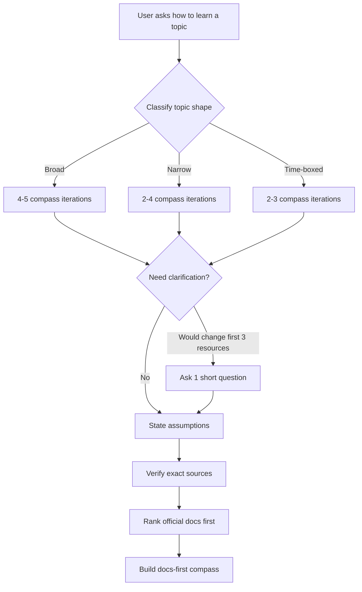
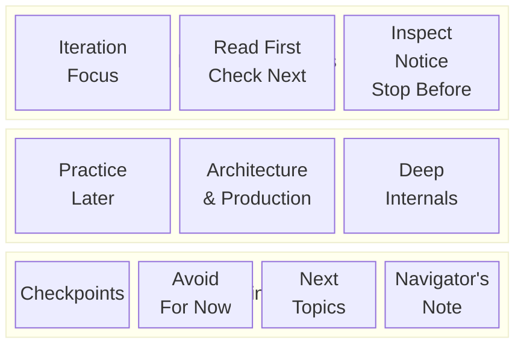
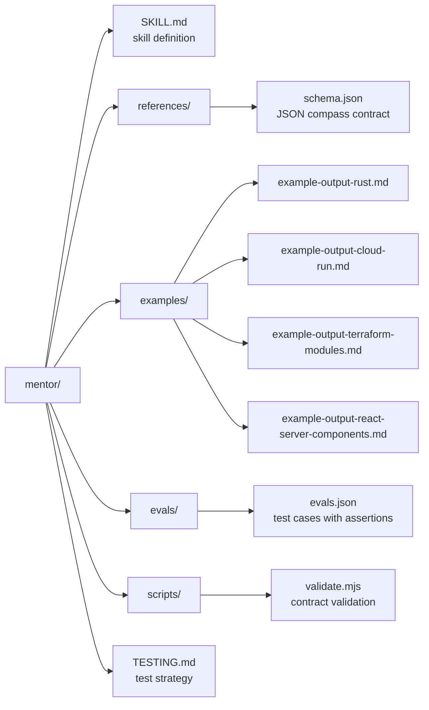

# Mentor

[](https://github.com/ayhammouda/mentor/releases/latest)
[](LICENSE)
[](https://docs.anthropic.com/en/docs/claude-code/skills)
[](https://docs.anthropic.com/en/docs/agents-and-tools/agent-skills/overview)
[](SKILL.md)

A skill for generating docs-first mentorship compasses for technical topics.

## Why This Is Different

Most learning-roadmap content online becomes one of three things:

- generic link dumps
- tutorial checklists with setup commands
- broad curricula that ignore what the learner needs to notice first

Mentor is designed to be a compass instead:

- **official-first** when canonical docs exist
- **directional** about what to read first, check next, inspect, and bookmark
- **sequenced by mental model**, not by project steps
- **clear about rabbit holes** to avoid early
- **hands-on only when requested**

## What It Does

Given a topic like "Terraform modules", "Google Cloud Run", or "Rust as a Go developer", Mentor generates:

- assumptions about learner level, goal, time budget, and context
- a short explanation of why the topic is tricky
- a Learning Compass with sequential iterations
- exact docs, references, repos, or examples to read, skim, inspect, or bookmark
- "what to notice" and "stop before" guidance for each iteration
- optional Explore Later branches
- self-assessment checkpoints
- avoid-for-now and next-topic guidance

It should feel like a senior engineer saying: read this page first, then check this doc, then inspect this repo for this pattern.

## What It Avoids By Default

Mentor does not generate:

- install commands
- `npx` or shell steps
- clone-and-run instructions
- mandatory exercises
- project walkthroughs
- quickstart-first curricula

Those are allowed only when the user explicitly asks for hands-on practice, labs, projects, or tutorials.

## How It Works


```mermaid
flowchart TD
    A["User asks how to learn a topic"] --> B{"Classify topic shape"}
    B -->|Broad| C["4-5 compass iterations"]
    B -->|Narrow| D["2-4 compass iterations"]
    B -->|Time-boxed| E["2-3 compass iterations"]
    C --> F{"Need clarification?"}
    D --> F
    E --> F
    F -->|"Would change first 3 resources"| G["Ask 1 short question"]
    F -->|No| H["State assumptions"]
    G --> H
    H --> I["Verify exact sources"]
    I --> J["Rank official docs first"]
    J --> K["Build docs-first compass"]
```

**Source ranking**: official docs first, maintainer/vendor material second, official sample repos as inspection targets, community content only when it fills a real gap.

## Output Shape


```mermaid
block-beta
    columns 1
    block:compass["Learning Compass"]
        columns 3
        i1["Iteration\nFocus"]
        i2["Read First\nCheck Next"]
        i3["Inspect\nNotice\nStop Before"]
    end
    block:later["Explore Later"]
        columns 3
        p1["Practice\nLater"]
        p2["Architecture\n& Production"]
        p3["Deep\nInternals"]
    end
    block:support["Supporting Notes"]
        columns 4
        s1["Checkpoints"]
        s2["Avoid\nFor Now"]
        s3["Next\nTopics"]
        s4["Navigator's\nNote"]
    end
```

Every compass resource includes: source tier, mode (`Read first` / `Read next` / `Skim for context` / `Inspect` / `Bookmark` / `Practice later`), exact URL, and sequencing rationale.

## Repository Structure


```mermaid
flowchart LR
    root["mentor/"] --> skill["SKILL.md\nskill definition"]
    root --> refs["references/"]
    root --> examples["examples/"]
    root --> evals["evals/"]
    root --> scripts["scripts/"]
    root --> testing["TESTING.md\ntest strategy"]
    refs --> schema["schema.json\nJSON compass contract"]
    examples --> ex1["example-output-rust.md"]
    examples --> ex2["example-output-cloud-run.md"]
    examples --> ex3["example-output-terraform-modules.md"]
    examples --> ex4["example-output-react-server-components.md"]
    evals --> evj["evals.json\ntest cases with assertions"]
    scripts --> validate["validate.mjs\ncontract validation"]
```

- **SKILL.md** is the source of truth for behavior, output format, source ranking, and anti-patterns.
- **references/schema.json** defines the machine-readable JSON contract.
- **examples/** contains gold-standard compass outputs.
- **evals/evals.json** contains test cases and assertions, including guards against tutorial drift.
- **scripts/validate.mjs** runs static contract checks for schema, evals, examples, enums, and stale terminology.

## Validation

```bash
npm test
```

The validation harness is dependency-free and runs on Node 18 or newer. See [TESTING.md](TESTING.md) for the full test strategy.

## Design Principle

Point the learner toward the right docs and inspection targets in the right order.

The skill should not feel like a search engine or a bootcamp syllabus. It should feel like a mentor giving the next few reading directions and explaining what to notice.

## Target Runtime

This skill is designed for Claude.ai and Claude Code skill runtimes, and can also guide Codex-style skill usage. It relies on current source lookup to verify resource URLs and freshness.

## Installation

### Option 1: Download the `.skill` file

Download [`mentor.skill`](https://github.com/ayhammouda/mentor/releases/latest) from the latest release, then:

| Platform | Command / Action |
|---|---|
| Claude Code | `claude skill add mentor.skill` |
| Claude.ai | Open a Project -> Settings -> Skills -> Upload `mentor.skill` |

### Option 2: Clone the repository

```bash
git clone https://github.com/ayhammouda/mentor.git ~/.claude/skills/mentor
```

### Option 3: Manual copy

Copy the `mentor/` directory into your skills location, such as `~/.claude/skills/mentor/`.

For more details:
- [Claude Code Skills](https://docs.anthropic.com/en/docs/claude-code/skills)
- [Claude.ai Agent Skills](https://docs.anthropic.com/en/docs/agents-and-tools/agent-skills/overview)

## Usage

Ask for direction:

- "What should I read to learn Kubernetes?"
- "Mentorship compass for Terraform modules"
- "I want to learn Rust. I know Go."
- "Which docs should I start with for React Server Components?"

For hands-on practice, ask explicitly:

- "Now give me practice ideas"
- "Turn this into a hands-on project path"
- "Give me exercises after the reading compass"

For JSON output, ask explicitly:

- "Give me a mentorship compass for Docker in JSON format"

## Contributing

Contributions welcome. See [CONTRIBUTING.md](CONTRIBUTING.md) for guidelines on preserving the mentorship compass behavior.

## License

[MIT](LICENSE)
